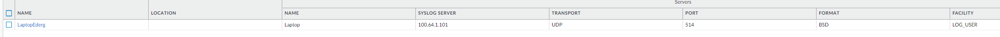
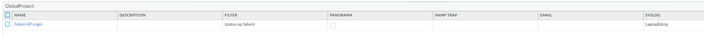
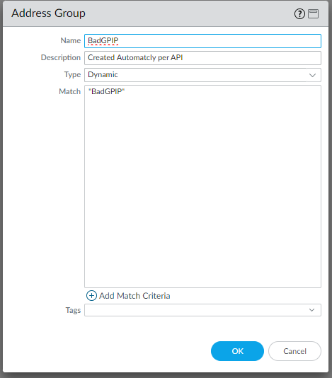
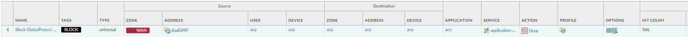
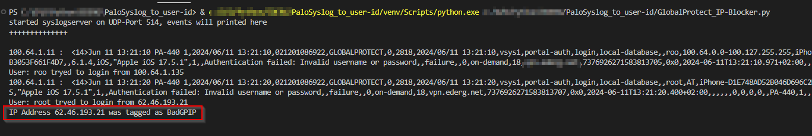
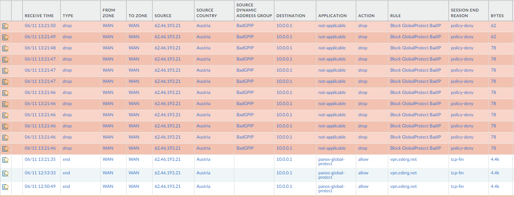
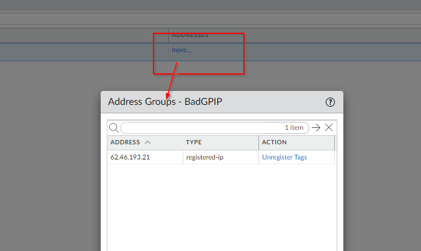
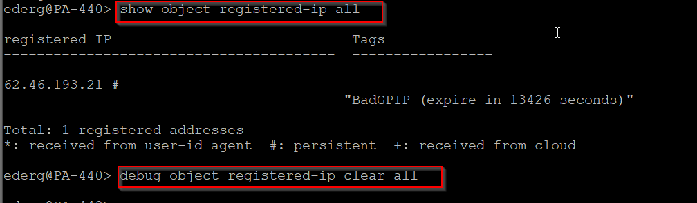
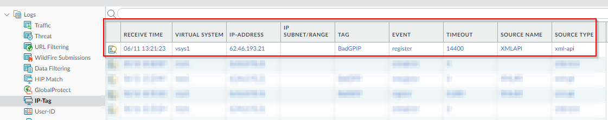

This is used for tagging IP-Adresses from Palolto Global-Protect logins with predefined usernames.
How it workes:
* Create a syslogserver in Paloalto GUI: Device / Syslog


* Forward failed login logs to that server Device / LogForward


* create dynamic address group with the tag "BadGPIP"


* create security policy to drop the connection from dynamic address


* modify the file  "example.env.txt" with credentials for logging in to the firewall and set the tag. Then rename it to ".env"

* modify "BadUsernames.txt" with the usernames you want to block

* install the required Python libs

```pip install -r requirements.txt```

* run the python script



* check logs and dynamic address-group








  

